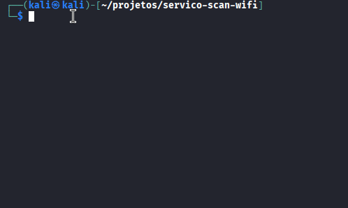

# <h1>Serviço de Análise de Segurança Wi-Fi</h1>

> **Resumo:** Um serviço de auditoria rápida para pequenos negócios e residências. Eu descubro "quem" está na sua rede, identifico dispositivos vulneráveis (como câmeras com senhas fracas) e entrego um relatório em PDF fácil de entender.

---

## 🎯 O Problema

Seu Wi-Fi está lento? Você oferece Wi-Fi para clientes no seu café? Você teme que seu vizinho esteja "pendurado" na sua rede ou que sua babá eletrônica esteja visível para o mundo? A maioria das redes não é segura, e você não tem como saber.

## 💡 A Solução (O Meu Serviço)

Eu vendo **paz de espírito**. Com acesso à sua rede (remoto ou presencial), eu rodo uma varredura profissional (usando Nmap) para:
* **Mapear:** Identificar TODOS os dispositivos conectados (celulares, laptops, Smart TVs, câmeras).
* **Alertar:** Encontrar dispositivos suspeitos ou desconhecidos.
* **Analisar:** Verificar portas abertas e serviços vulneráveis (Ex: câmeras com painel de login aberto).
* **Entregar:** Fornecer um relatório em PDF em 24h, escrito em português claro, com recomendações de segurança.

---

## 🛠️ O que eu entrego

### Pacote Básico (Auditoria Rápida)
* Scan de Nmap (feito por mim).
* Relatório PDF com a lista de dispositivos e riscos encontrados.

### Pacote Premium (Auditoria + Correção)
* Tudo do Básico.
* **Acesso Remoto:** Eu acesso seu roteador (com sua permissão) e:
    * Mudo a senha do Wi-Fi (para expulsar invasores).
    * Atualizo o firmware do roteador.
    * Troco a senha de login do roteador (de `admin` para uma segura).
* 3 dias de suporte via WhatsApp.
